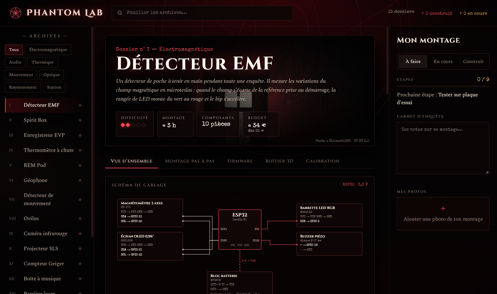
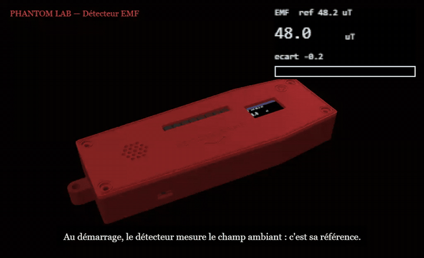
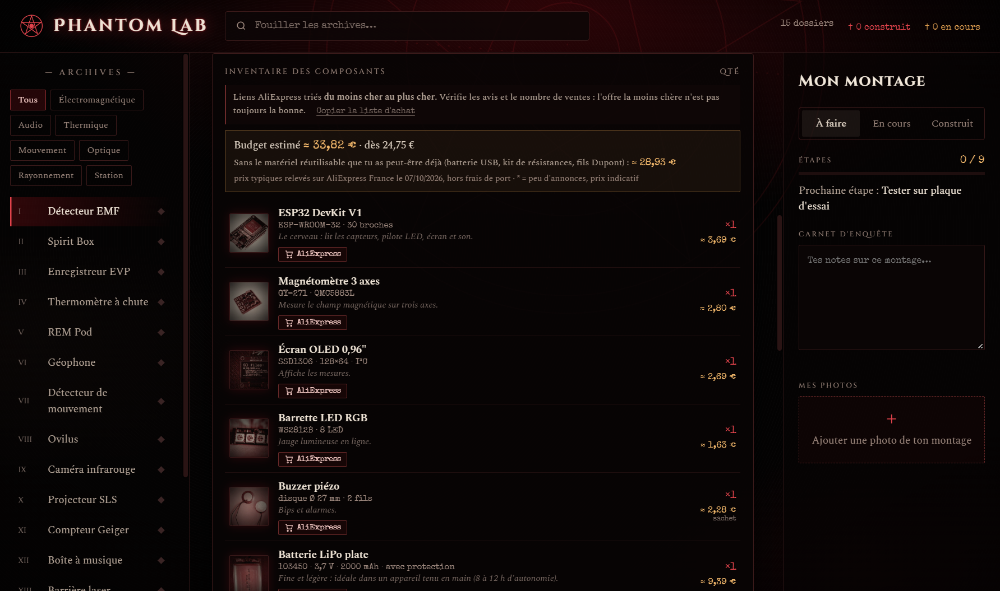
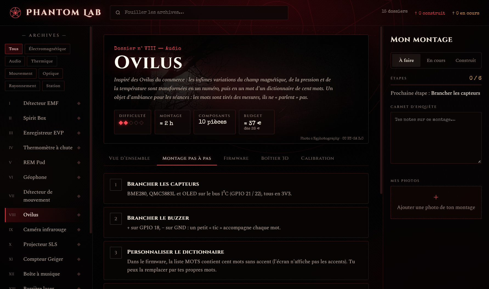
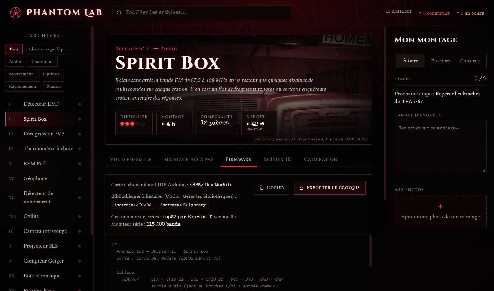
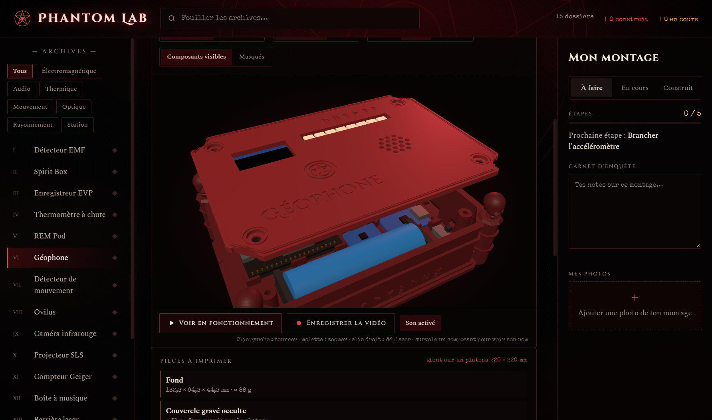
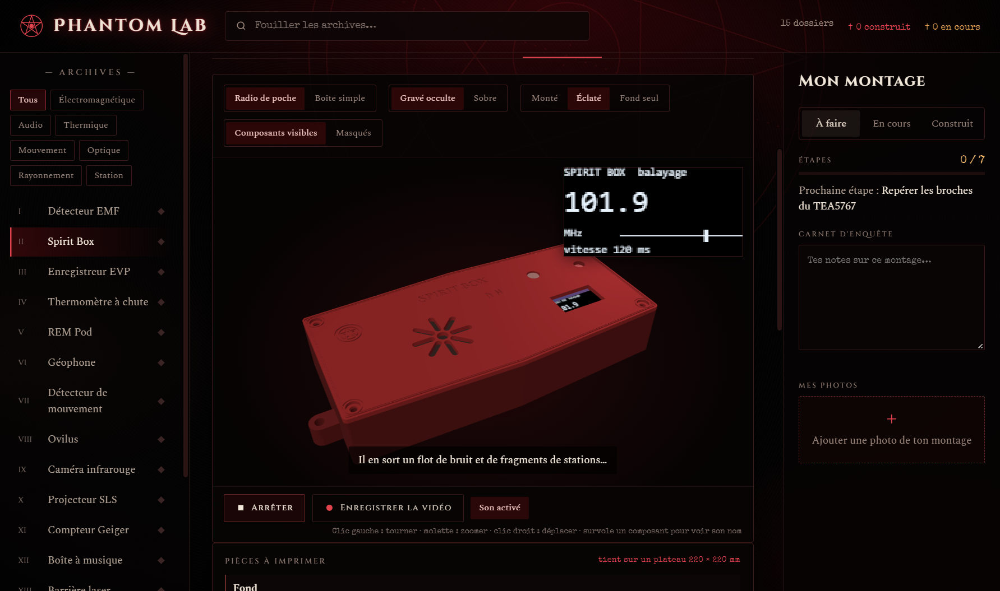
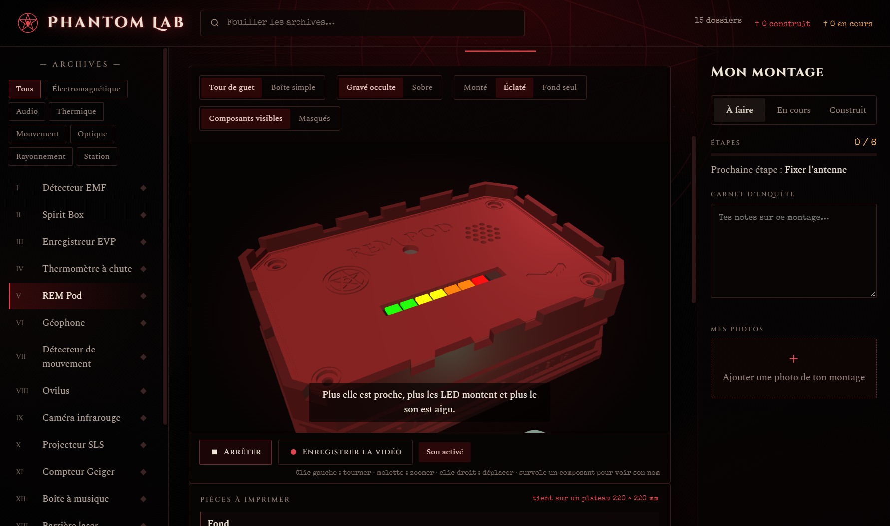

# 🕯️ PHANTOM LAB

### L'atelier des détecteurs paranormaux à fabriquer soi-même.

*15 prototypes d'enquête à monter de vos mains : détecteur EMF, Spirit Box, REM Pod, compteur Geiger… Pour chacun : les composants, le câblage, le montage pas à pas, le programme de la carte et un boîtier 3D à imprimer.*

 

 

<i>Le dossier n° I : le détecteur EMF, avec son schéma de câblage généré.</i>

  

[**Pourquoi**](#-pourquoi-phantom-lab-) · [**Les 15 prototypes**](#-les-15-prototypes) · [**Fonctionnalités**](#-fonctionnalités) · [**En images**](#%EF%B8%8F-en-images) · [**Télécharger**](#%EF%B8%8F-télécharger) · [**Questions fréquentes**](#-questions-fréquentes)

 

---

## 🩸 Pourquoi Phantom Lab ?

Les appareils d'enquête du commerce coûtent cher, et on ne sait jamais vraiment ce qu'ils mesurent. Les fabriquer soi-même, c'est moins cher, bien plus amusant… et on comprend enfin ce que l'appareil détecte.

**Phantom Lab réunit tout ce qu'il faut dans un seul logiciel** : la liste des pièces avec les liens AliExpress les moins chers, le schéma de câblage, chaque étape du montage, le programme à envoyer dans la carte ESP32, les réglages, et un boîtier à thème à imprimer en 3D. Vous suivez aussi l'avancement de vos propres montages, avec vos notes et vos photos.

 

## 👻 Les 15 prototypes

| | Prototype | Famille | | Prototype | Famille |
|:-:|---|---|:-:|---|---|
| I | **Détecteur EMF** | Électromagnétique | IX | **Caméra infrarouge** | Optique |
| II | **Spirit Box** | Audio | X | **Projecteur SLS** | Optique |
| III | **Enregistreur EVP** | Audio | XI | **Compteur Geiger** | Rayonnement |
| IV | **Thermomètre à chute** | Thermique | XII | **Boîte à musique** | Audio |
| V | **REM Pod** | Électromagnétique | XIII | **Barrière laser** | Mouvement |
| VI | **Géophone** | Mouvement | XIV | **Détecteur de charge statique** | Électromagnétique |
| VII | **Détecteur de mouvement** | Mouvement | XV | **Station d'enquête Wi-Fi** | Station |
| VIII | **Ovilus** | Audio | | | |

 

## ✨ Fonctionnalités

<table>
<tr>
<td width="50%" valign="top">

### 📜 Un dossier complet par appareil
- **Schéma de câblage** clair, broche par broche.
- **Inventaire des composants** avec photos.
- **Montage pas à pas**, étape par étape.
- **Calibration** et **conseils de terrain** (dont les pièges des téléphones portables).

</td>
<td width="50%" valign="top">

### 🛒 Les pièces au meilleur prix
- **Liens AliExpress** triés du moins cher au plus cher.
- **Budget estimé** de chaque projet, avec un prix « dès ».
- **Liste d'achat** copiée en un clic.
- Le matériel qui resservira d'un projet à l'autre (kits de résistances, fils, batterie USB) est **signalé à part**.

</td>
</tr>
<tr>
<td width="50%" valign="top">

### 💀 Des boîtiers 3D à imprimer
- Une **forme à thème** par appareil (cercueil, reliquaire, tour de guet…) ou une **boîte simple**.
- Deux couvercles : **gravé occulte** ou **sobre**.
- **Intérieur aménagé** : chaque composant a sa place.
- Formats **de poche** pour les appareils tenus en main pendant des heures.
- **Aperçu 3D** rotatif, export **STL** et réglages d'impression (plateau 220 × 220 mm).

</td>
<td width="50%" valign="top">

### 🔮 Voir l'appareil fonctionner
- **Simulation animée** de chaque appareil : LED, écran, sons.
- **Vidéo MP4** de la simulation, en un clic.
- **Programme ESP32** prêt à copier ou exporter (14 appareils).
- **Suivi de vos montages** : statut, étapes cochées, carnet d'enquête, vos photos.

</td>
</tr>
</table>

 

<i>La simulation du détecteur EMF : une source approche, les LED montent du vert au rouge.</i>

 

## 🖼️ En images

<table>
<tr>
<td width="50%" align="center">
 
<b>Composants et budget</b> Photos, liens AliExpress du moins cher, prix estimés.
</td>
<td width="50%" align="center">
 
<b>Montage pas à pas</b> Chaque étape se coche au fil du montage.
</td>
</tr>
<tr>
<td width="50%" align="center">
 
<b>Programme de la carte</b> Carte, bibliothèques et code prêt à téléverser.
</td>
<td width="50%" align="center">
 
<b>Boîtier 3D</b> Vue éclatée avec les composants en place.
</td>
</tr>
<tr>
<td width="50%" align="center">
 
<b>Simulation : Spirit Box</b> Le balayage de la bande FM, en image et en son.
</td>
<td width="50%" align="center">
 
<b>Simulation : REM Pod</b> Plus la source est proche, plus les LED montent.
</td>
</tr>
</table>

 

## ⬇️ Télécharger

### [**➜ Page de téléchargement (dernière version)**](https://github.com/lerapeurdu62280-debug/PhantomLab-Download/releases/latest)

**Gratuit.**

| Fichier | Pour qui ? |
|---|---|
| **`PhantomLab-Portable.exe`** | Aucune installation : un seul fichier, à lancer depuis n'importe quel dossier ou clé USB. |

> **Windows affiche « Windows a protégé votre ordinateur » ?** C'est normal pour un logiciel récent. Cliquez sur **Informations complémentaires**, puis sur **Exécuter quand même**.

### 🖥️ Configuration requise
- **Windows 10 ou 11**, 64 bits.
- **Microsoft Edge WebView2** (déjà présent sur Windows 11 et sur la plupart des Windows 10 à jour).
- Pour les montages : un fer à souder, une carte **ESP32**, et l'**IDE Arduino** pour envoyer le programme.

 

## ❓ Questions fréquentes

<b>Ces appareils détectent-ils vraiment les fantômes ?</b>

 
Ils mesurent des phénomènes physiques bien réels : champ magnétique, température, vibrations, mouvement, rayonnement, charge électrique, son. Ce sont les mêmes principes que les appareils d'enquête du commerce. L'interprétation, c'est à vous de la faire… en éliminant d'abord les causes ordinaires (prises, câbles, téléphones, courants d'air) : chaque dossier vous explique lesquelles.

<b>Faut-il savoir programmer ?</b>

 
Non. Le programme de chaque appareil est fourni : on le copie dans l'IDE Arduino et on l'envoie dans la carte. Le dossier indique la carte à choisir et les bibliothèques à installer. Savoir souder est en revanche nécessaire.

<b>Combien coûte un montage ?</b>

 
Chaque dossier affiche un budget estimé à partir des prix AliExpress relevés en octobre 2026, avec un prix « dès » pour les plus économes (hors frais de port). Les prix changent souvent : vérifiez-les au moment de commander.

<b>Je n'ai pas d'imprimante 3D.</b>

 
Chaque appareil propose aussi une boîte simple, et les fichiers STL exportés peuvent être confiés à un service d'impression en ligne ou à un fablab.

<b>La simulation, c'est le vrai appareil ?</b>

 
C'est une démonstration animée de ce que l'appareil fait une fois monté : elle sert à comprendre son fonctionnement avant de souder. Ce n'est pas une mesure réelle.

<b>La barrière laser est-elle dangereuse ?</b>

 
Utilisez un module laser de classe 2 (1 mW maximum) et ne visez jamais les yeux. Le dossier le rappelle.

 

---

💬 Vous avez monté un prototype ? Montrez-le sur le **[Discord de l'atelier](https://discord.gg/W5hd36CW6b)**.

**Phantom Lab** — conçu et développé par **S.O.S INFO LUDO**

Logiciel gratuit, propriétaire, tous droits réservés. Photos d'ambiance : Wikimedia Commons (licences CC, crédits affichés dans le logiciel). Polices Cinzel, Special Elite et Spectral (SIL OFL). AliExpress et Arduino sont des marques de leurs propriétaires respectifs. Ce logiciel n'est affilié à aucune de ces marques.

